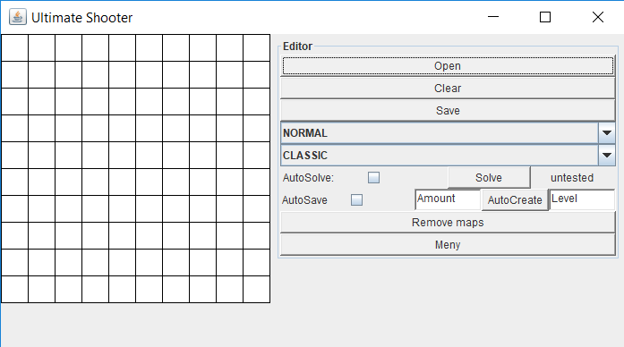

# UltimateShooter
A game created in java, similar to fling and shooter but with some cool new features, time attack and multiplayer mode.
Contains a gameengine that can autocreate and autosolve puzzles for endless gameplay.

# Inspiration
I got insperation to this project from a game called shooter, later called fling (can be downloaded on app-store).

# Functions
The program windows are described by the images below. The game goal is to only have one ball left on the gameboard.
Several gamemodes exist, for instance time attack and endless, where a ai creates new maps for you.

# Menu

# Play

# Start

# Create Custom Map

# Multiplayer

# Highscore

